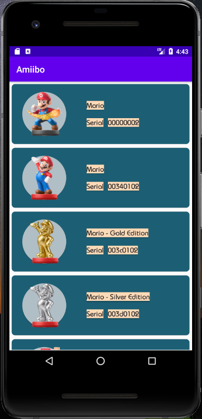
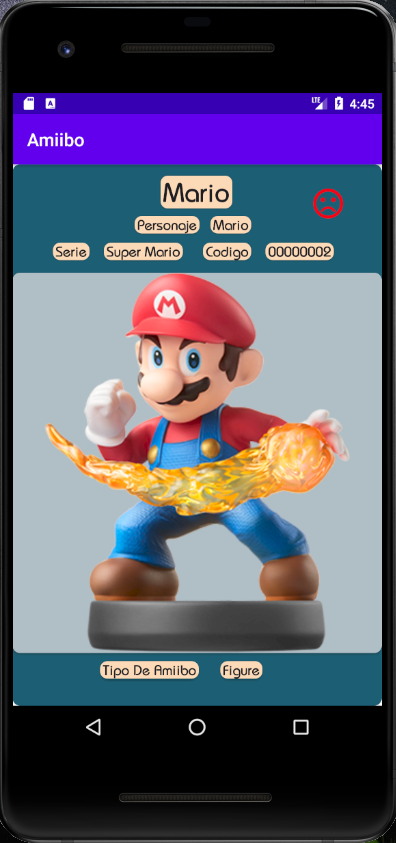

# Amiibo APP
  Aplicacion que muestra datos basicos de la coleccion de amiibo de nintendo


## Consumo de Api

  Consume datos de la API

```bash
  https://www.amiiboapi.com
```

## Implementacion

- [Retrofit](https://square.github.io/retrofit/) - Consumo de API
- [Picasso](https://square.github.io/picasso/) - Importar imágenes
- [Lifecycle](https://developer.android.com/jetpack/androidx/releases/lifecycle) - Respuesta segun ciclo de vida de los componentes
- [Room](https://developer.android.com/jetpack/androidx/releases/room) - Acceso a base de datos

## Capturas de pantalla




## Funcionamiento

- La aplicación muetra en la pantalla principal el listado completo de la lista de figuras Amiibo
- La aplicación muestra una pantalla de detalle de cada figura selecionada


## POR DESARROLLAR

- Habilitar boton de favorito
- Habilitar Listado de favorito 
- Habilitar Busqueda de Amiibo por nombre , Serie 


## Desarrollado

- Alejandro Pérez García 

